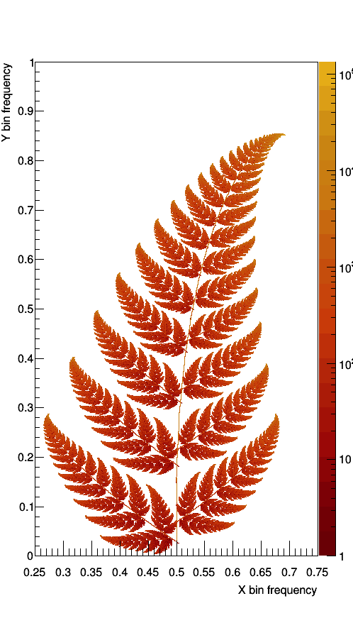
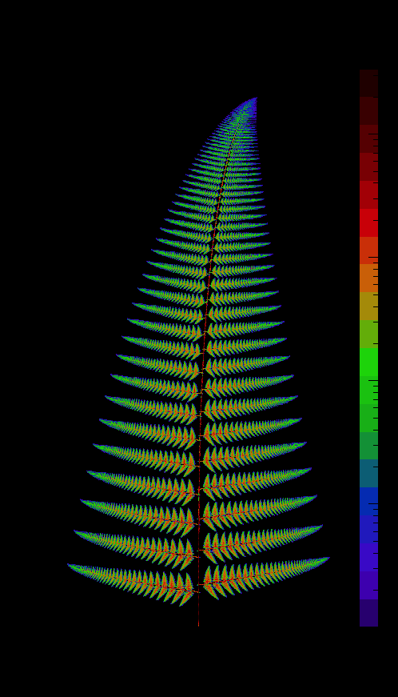

# Mutated Barnsley Ferns
* Generating fractal ferns using C++ where plotting makes use of CERN's ROOT libraries, which may be <a href="https://root.cern.ch/download/root_v6.14.04.source.tar.gz"><downloaded here</a>:
* Assuming ROOT is installed, enter the ROOT shell (root -l) and run .x fern_gen.cpp++ (Caution: code generates many images).
* A description of this project may be found <a href="https://freddyox.github.io/blog/fractal-fern/">within my website</a>, which explicitly shows the math transformations required for replication.

## Outputs:
* Here is a traditional Barnsley fern and an animation:

* Here is a mutated fern:

